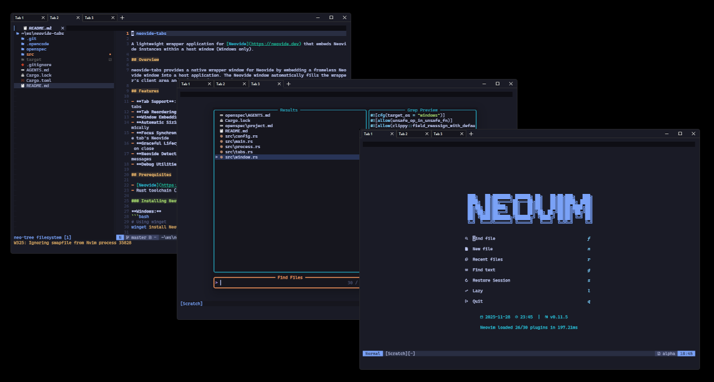

# neovide-tabs

A lightweight wrapper application for [Neovide](https://neovide.dev) that embeds Neovide instances within a host window (Windows only).



## Overview

neovide-tabs provides a native wrapper window for Neovide by embedding a frameless Neovide window into a host application. The Neovide window automatically fills the wrapper's client area and maintains focus synchronization.

## Features

- **Tab Support**: Create, close, and switch between multiple Neovide instances using tabs
- **Tab Reordering**: Drag tabs to rearrange their order
- **Profile Support**: Configure multiple profiles with custom working directories and icons
- **Custom Icons**: Per-profile PNG icons loaded from `~/.config/neovide-tabs/icons/`
- **Configurable**: JSON configuration file for background color and profiles
- **Custom Titlebar**: Native custom titlebar with Windows 11 rounded corners
- **Window Embedding**: Embeds Neovide with `--frame none` for seamless integration
- **Automatic Sizing**: Neovide windows fill the wrapper's client area and resize dynamically
- **Focus Synchronization**: Wrapper window activation automatically focuses the active tab's Neovide
- **Graceful Lifecycle**: Clean process management with graceful close (WM_CLOSE) for all tabs
- **Process Polling**: Automatic detection and handling of Neovide process exits
- **Neovide Detection**: Validates Neovide installation at startup with helpful error messages
- **Debug Utilities**: `list-windows` command for troubleshooting window detection

## Prerequisites

- [Neovide](https://neovide.dev) must be installed and available in your system PATH
- Rust toolchain (2024 edition or later)

### Installing Neovide

```bash
# Using winget
winget install Neovide.Neovide

# Using Scoop
scoop install neovide

# Or download from releases
# https://github.com/neovide/neovide/releases
```

## Getting Started

### Building from Source

```bash
# Clone the repository
git clone https://github.com/yourusername/neovide-tabs.git
cd neovide-tabs

# Build the project
cargo build --release

# Run the application
cargo run --release
```

### Development

```bash
# Run in development mode
cargo run

# Run tests
cargo test

# Check code with clippy
cargo clippy -- -D warnings

# Format code
cargo fmt
```

## Usage

### Basic Usage

Launch neovide-tabs from your desired working directory:

```bash
neovide-tabs
```

The application will:
1. Open a wrapper window (1024x768, minimum 800x600) with a tab bar
2. Create an initial tab with a Neovide instance (`--frame none`)
3. Position and resize the Neovide window to fill the content area
4. Automatically bring the active tab's Neovide to foreground when the wrapper is activated

### Tab Management

- **New Tab**: Click the (+) button to create a new tab with the default profile
- **Profile Dropdown**: Click the caret (v) next to (+) to select a profile for a new tab
- **Switch Tabs**: Click on a tab to switch to it; its Neovide instance becomes visible
- **Close Tab**: Click the (x) on a tab to close it gracefully (respects unsaved changes)
- **Reorder Tabs**: Drag tabs to rearrange their order

When the last tab is closed, the application exits.

### Configuration

Configuration is stored at `~/.config/neovide-tabs/config.json`:

```json
{
  "background_color": "#1a1b26",
  "profiles": [
    {
      "name": "Default",
      "icon": "neovide.png",
      "working_directory": "~"
    },
    {
      "name": "Work",
      "icon": "work.png",
      "working_directory": "~/projects/work"
    }
  ]
}
```

**Configuration options:**

- `background_color`: Hex color for the titlebar and content area border (default: `#1a1b26` - Tokyo Night)
- `profiles`: Array of profile definitions:
  - `name`: Display name shown on tabs
  - `icon`: PNG filename (loaded from `~/.config/neovide-tabs/icons/`)
  - `working_directory`: Starting directory for Neovide (supports `~` expansion)

Place PNG icons in `~/.config/neovide-tabs/icons/`. Icons are automatically scaled to 16x16 pixels.

### Debug Commands

```bash
# List all windows matching a search term (default: "neovide")
neovide-tabs list-windows [search-term]

# Show help
neovide-tabs help
```

### Closing

- Close the wrapper window normally (Alt+F4, close button, etc.)
- The embedded Neovide process will be gracefully terminated

## Architecture

The application consists of six main modules:

- **main.rs**: Entry point with CLI argument handling and startup validation
- **window.rs**: Win32 window management, message loop, custom titlebar, tab bar rendering, profile dropdown popup, and state handling
- **tabs.rs**: Tab management (TabManager, Tab, DragState) for multiple Neovide instances
- **process.rs**: Neovide process spawning, window discovery, and positioning
- **config.rs**: Configuration loading and parsing from JSON, profile management
- **icons.rs**: Icon loading (PNG), caching, and Win32 bitmap conversion

## Limitations

- **Windows only**: Currently only supports Windows (uses Win32 API directly)
- **No tab persistence**: Tab sessions are not saved across application restarts
- **No keyboard shortcuts**: Tab navigation currently requires mouse interaction

## Roadmap

- [x] Project setup and architecture
- [x] Basic window wrapper
- [x] Neovide process spawning with `--frame none`
- [x] Window embedding and sizing
- [x] Graceful process lifecycle handling
- [x] Focus synchronization
- [x] Tab bar UI for multiple instances
- [x] Tab creation and management
- [x] Tab reordering via drag-and-drop
- [x] Configurable tab behavior (custom working directories via profiles)
- [x] Profile support with custom icons
- [ ] Keyboard shortcuts for tab navigation
- [ ] Persistent tab sessions
- [ ] Cross-platform support (Linux, macOS)

## Contributing

Contributions are welcome! Please read the development guidelines in `AGENTS.md` and `openspec/AGENTS.md` before submitting pull requests.

### Code Style

- Follow Rust standard formatting (`cargo fmt`)
- Pass all clippy checks (`cargo clippy -- -D warnings`)
- Write tests for new functionality
- Update documentation as needed

## License

[License TBD]

## Acknowledgments

- [Neovide](https://neovide.dev) - The excellent Neovim GUI that this project wraps
- [Neovim](https://neovim.io) - The extensible text editor

## Project Status

**Current Version:** 0.3.0 (Profile Support)

The application now supports multiple tabs with profile-based configuration. Each profile can have a custom name, icon, and working directory. Users can create tabs from any profile via a dropdown menu, close tabs gracefully (respecting unsaved changes), switch between tabs, and reorder them via drag-and-drop. The next milestone is adding keyboard shortcuts for tab navigation.
