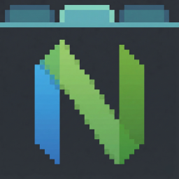

# neovide-tabs

A lightweight Windows application that provides a tabbed interface to manage multiple [Neovide](https://neovide.dev) instances.


## Overview

neovide-tabs provides a native wrapper window for Neovide by embedding a frameless Neovide window into a host application. The Neovide window automatically fills the wrapper's client area and maintains focus synchronization.

## Features

- **Tab Support**: Create, close, and switch between multiple Neovide instances using tabs
- **Tab Reordering**: Drag tabs to rearrange their order
- **Dynamic Tab Titles**: Customizable tab titles with token expansion (profile name, working directory, window title, or relative file path)
- **Global Hotkeys**: System-wide keyboard shortcuts to switch tabs or open profiles from any application
- **Profile Support**: Configure multiple profiles with custom working directories, icons, hotkeys, and title formats
- **Custom Icons**: Per-profile PNG icons loaded from `~/.config/neovide-tabs/icons/`
- **Configurable**: JSON configuration file for background color, profiles, and hotkeys
- **Custom Titlebar**: Native custom titlebar with Windows 11 rounded corners
- **Window Embedding**: Embeds Neovide with `--frame none` for seamless integration
- **Automatic Sizing**: Neovide windows fill the wrapper's client area and resize dynamically
- **Focus Synchronization**: Wrapper window activation automatically focuses the active tab's Neovide
- **Graceful Lifecycle**: Clean process management with graceful close (WM_CLOSE) for all tabs
- **Process Polling**: Automatic detection and handling of Neovide process exits
- **Neovide Detection**: Validates Neovide installation at startup with helpful error messages
- **Debug Utilities**: `list-windows` command for troubleshooting window detection


## Prerequisites

- [NeoVim](https://neovim.io/) must be installed and available in your system PATH
- [NeoVide](https://neovide.dev) must be installed and available in your system PATH
- Rust toolchain (2024 edition or later)

## Getting Started

`neovide-tabs` is in development. To use it, you will need to be able to compile Rust programs for Windows. To get started, see [https://rust-lang.org/tools/install/](https://rust-lang.org/tools/install/).

### Building from Source

```bash
# Clone the repository
git clone https://github.com/keathmilligan/neovide-tabs.git
cd neovide-tabs

# Build the project and copy the target\release\neovide-tabs.exe
# to your local ~\bin directory (or equivalent)
cargo build --release

# Alternayively, run the application from the workspace
cargo run
```

### Development

```bash
# Run in development mode
cargo run

# Run tests
cargo test

# Check code with clippy
cargo clippy -- -D warnings

# Format code
cargo fmt
```

## Usage

### Basic Usage

Launch neovide-tabs from your desired working directory:

```bash
neovide-tabs
```

The application will:
1. Open a wrapper window (1024x768, minimum 800x600) with a tab bar
2. Create an initial tab with a Neovide instance (`--frame none`)
3. Position and resize the Neovide window to fill the content area
4. Automatically bring the active tab's Neovide to foreground when the wrapper is activated

### Tab Management

- **New Tab**: Click the (+) button to create a new tab with the default profile
- **Profile Dropdown**: Click the caret (v) next to (+) to select a profile for a new tab
- **Switch Tabs**: Click on a tab to switch to it; its Neovide instance becomes visible
- **Close Tab**: Click the (x) on a tab to close it gracefully (respects unsaved changes)
- **Reorder Tabs**: Drag tabs to rearrange their order

When the last tab is closed, the application exits.

### Global Hotkeys

neovide-tabs registers system-wide hotkeys that work regardless of which application is focused:

**Default Tab Hotkeys:**
- `Ctrl+Shift+1` through `Ctrl+Shift+9`: Activate tabs 1-9
- `Ctrl+Shift+0`: Activate tab 10

**Default Profile Hotkeys:**
- `Ctrl+Shift+F1`: Open or activate the Default profile
- Additional profiles can have custom hotkeys defined in configuration

Profile hotkeys will:
- Activate an existing tab with that profile if one exists
- Create a new tab with that profile if none exists

### Configuration

Configuration is stored at `~/.config/neovide-tabs/config.json`:

```json
{
  "background_color": "#1a1b26",
  "profiles": [
    {
      "name": "Default",
      "icon": "neovide.png",
      "working_directory": "~",
      "hotkey": "Ctrl+Shift+F1"
    },
    {
      "name": "Work",
      "icon": "work.png",
      "working_directory": "~/projects/work",
      "hotkey": "Ctrl+Shift+F2",
      "title": "%t"
    }
  ],
  "hotkeys": {
    "tab": {
      "1": "Ctrl+Shift+1",
      "2": "Ctrl+Shift+2",
      "3": "Ctrl+Shift+3"
    }
  }
}
```

**Configuration options:**

- `background_color`: Hex color for the titlebar and content area border (default: `#1a1b26` - Tokyo Night)
- `profiles`: Array of profile definitions:
  - `name`: Display name shown on tabs (used as fallback when title is empty)
  - `icon`: PNG filename (loaded from `~/.config/neovide-tabs/icons/`)
  - `working_directory`: Starting directory for Neovide (supports `~` expansion)
  - `hotkey`: (optional) Global hotkey to open/activate this profile (e.g., `"Ctrl+Shift+F1"`)
  - `title`: (optional) Tab title format with token expansion (default: `"%t"`)
    - `%p` - Profile name
    - `%w` - Working directory (with `~` for home)
    - `%t` - Neovide window title
    - `%f` - Relative file path (extracts path from window title relative to working directory; if the path is not under the working directory, returns the window title as-is)
- `hotkeys`: (optional) Hotkey configuration:
  - `tab`: Map of tab number to hotkey string (e.g., `{"1": "Ctrl+Shift+1"}`)

**Hotkey format:** `Modifier+Modifier+Key` where modifiers are `Ctrl`, `Alt`, `Shift`, `Win` and keys are `A-Z`, `0-9`, or `F1-F12`.

To disable default tab hotkeys, set `"hotkeys": {"tab": {}}`.

Place PNG icons in `~/.config/neovide-tabs/icons/`. Icons are automatically scaled to 16x16 pixels.

### Debug Commands

```bash
# List all windows matching a search term (default: "neovide")
neovide-tabs list-windows [search-term]

# Show help
neovide-tabs help
```

### Closing

- Close the wrapper window normally (Alt+F4, close button, etc.)
- The embedded Neovide process will be gracefully terminated

## Architecture

The application consists of seven main modules:

- **main.rs**: Entry point with CLI argument handling and startup validation
- **window.rs**: Win32 window management, message loop, custom titlebar, tab bar rendering, profile dropdown popup, and state handling
- **tabs.rs**: Tab management (TabManager, Tab, DragState) for multiple Neovide instances
- **process.rs**: Neovide process spawning, window discovery, and positioning
- **config.rs**: Configuration loading and parsing from JSON, profile management
- **icons.rs**: Icon loading (PNG), caching, and Win32 bitmap conversion
- **hotkeys.rs**: Global hotkey registration, parsing, and Win32 hotkey integration

## Limitations

- **Windows only**: Currently only supports Windows (uses Win32 API directly)
- **No tab persistence**: Tab sessions are not saved across application restarts

## Roadmap

- [x] Project setup and architecture
- [x] Basic window wrapper
- [x] Neovide process spawning with `--frame none`
- [x] Window embedding and sizing
- [x] Graceful process lifecycle handling
- [x] Focus synchronization
- [x] Tab bar UI for multiple instances
- [x] Tab creation and management
- [x] Tab reordering via drag-and-drop
- [x] Configurable tab behavior (custom working directories via profiles)
- [x] Profile support with custom icons
- [x] Global hotkeys for tab navigation and profile activation
- [ ] Persistent tab sessions

## Contributing

Contributions are welcome!

### Code Style

- Follow Rust standard formatting (`cargo fmt`)
- Pass all clippy checks (`cargo clippy -- -D warnings`)
- Write tests for new functionality
- Update documentation as needed

## License

MIT

## Acknowledgments

- [Neovide](https://neovide.dev) - The excellent Neovim GUI that this project wraps
- [Neovim](https://neovim.io) - The extensible text editor
