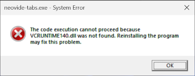

# neovide-tabs

A lightweight Windows application that provides a tabbed interface to manage multiple [Neovide](https://neovide.dev) instances.


## Overview

neovide-tabs provides a native wrapper window for Neovide by embedding a frameless Neovide window into a host application. The Neovide window automatically fills the wrapper's client area and maintains focus synchronization.

## Features

- **Tab Support**: Create, close, and switch between multiple Neovide instances using tabs
- **Dynamic Tab Titles**: Customizable tab titles with token expansion (profile name, working directory, window title, or relative file path)
- **Global Hotkeys**: System-wide keyboard shortcuts to switch tabs or open profiles from any application
- **Profile Support**: Configure multiple profiles with custom working directories, icons, hotkeys, and title formats


## Prerequisites

- [NeoVim](https://neovim.io/) must be installed and available in your system PATH
- [NeoVide](https://neovide.dev) must be installed and available in your system PATH

## Installation

Download the latest MSI installer from the [Releases](https://github.com/keathmilligan/neovide-tabs/releases) page. Check your downloads list, you may need to select "Keep" or "Download Anyway".

Launch the installer.

**(Optional) Silent command-line installation:**
```powershell
# Per-user (no admin required)
msiexec /i neovide-tabs-x.y.z.msi /qn

# Per-machine (requires admin)
msiexec /i neovide-tabs-x.y.z.msi /qn ALLUSERS=1
```

## Usage

### Basic Usage

Launch neovide-tabs from the Start menu or from the command-line with:

```bash
neovide-tabs
```

### Tab Management

- **New Tab**: Click the (+) button to create a new tab with the default profile
- **Profile Dropdown**: Click the caret (v) next to (+) to select a profile for a new tab
- **Switch Tabs**: Click on a tab to switch to it; its Neovide instance becomes visible
- **Close Tab**: Click the (x) on a tab to close it gracefully (respects unsaved changes)
- **Reorder Tabs**: Drag tabs to rearrange their order

When the last tab is closed, the application exits.

### Global Hotkeys

neovide-tabs registers system-wide hotkeys that work regardless of which application is focused:

**Default Tab Hotkeys:**
- `Ctrl+Shift+1` through `Ctrl+Shift+9`: Activate tabs 1-9
- `Ctrl+Shift+0`: Activate tab 10

**Default Profile Hotkeys:**
- `Ctrl+Shift+F1`: Open or activate the Default profile
- Additional profiles can have custom hotkeys defined in configuration

### Configuration

Configuration is stored at `~/.config/neovide-tabs/config.json`:

```json
{
  "background_color": "#1a1b26",
  "profiles": [
    {
      "name": "Default",
      "icon": "neovide.png",
      "working_directory": "~",
      "hotkey": "Ctrl+Shift+F1"
    },
    {
      "name": "Work",
      "icon": "work.png",
      "working_directory": "~/projects/work",
      "hotkey": "Ctrl+Shift+F2",
      "title": "%t"
    }
  ],
  "hotkeys": {
    "tab": {
      "1": "Ctrl+Shift+1",
      "2": "Ctrl+Shift+2",
      "3": "Ctrl+Shift+3"
    }
  }
}
```

#### Configuration options

- `background_color`: Hex color for the titlebar and content area border (default: `#1a1b26` - Tokyo Night)
- `profiles`: Array of profile definitions:
  - `name`: Display name shown on tabs (used as fallback when title is empty)
  - `icon`: PNG/SVG filename
  - `working_directory`: Starting directory for Neovide (supports `~` expansion)
  - `hotkey`: (optional) Global hotkey to open/activate this profile (e.g., `"Ctrl+Shift+F1"`)
  - `title`: (optional) Tab title format with token expansion (default: `"%t"`)
    - `%p` - Profile name
    - `%w` - Working directory (with `~` for home)
    - `%t` - Neovide window title
    - `%f` - Relative file path (extracts path from window title relative to working directory; if the path is not under the working directory, returns the window title as-is)
- `hotkeys`: (optional) Hotkey configuration:
  - `tab`: Map of tab number to hotkey string (e.g., `{"1": "Ctrl+Shift+1"}`)

#### Hotkeys

**Hotkey format:** `Modifier+Modifier+Key` where modifiers are `Ctrl`, `Alt`, `Shift`, `Win` and keys are `A-Z`, `0-9`, or `F1-F12`.

To disable default tab hotkeys, set `"hotkeys": {"tab": {}}`.

### Closing Tabs or the App

- Close the wrapper window normally (Alt+F4, close button, etc.)
- The embedded Neovide process will be gracefully terminated
- NeoVim may prompt you to save files before exiting

## Troubleshooting

### VCRUNTIME Error



This error typically means you haven't installed NeoVim/Neovide (see above). Installing them will also install the required runtime package.

### neovide-tabs Won't Start

If the app doesn't start, it is likely due to a configuration error. Run `neovide-tabs.exe` from the command-line to see startup messages.

## Development

### Building from Source

Requires: Rust toolchain (2024 edition or later). See [https://rust-lang.org/tools/install/](https://rust-lang.org/tools/install/).

```bash
# Clone the repository
git clone https://github.com/keathmilligan/neovide-tabs.git
cd neovide-tabs

# Build the project and copy the target\release\neovide-tabs.exe
# to your local ~\bin directory (or equivalent)
cargo build --release
```

### Debugging/Testing

```bash
# Run in development mode
cargo run

# Run tests
cargo test

# Check code with clippy
cargo clippy -- -D warnings

# Format code
cargo fmt
```
